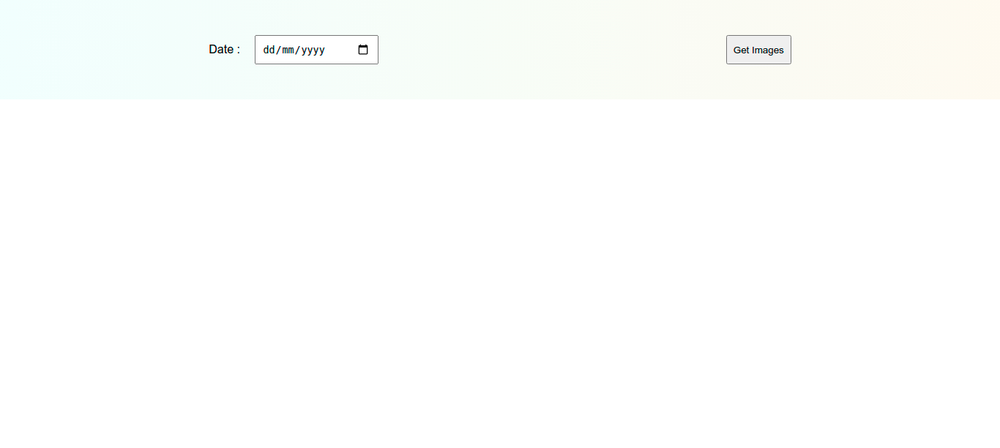
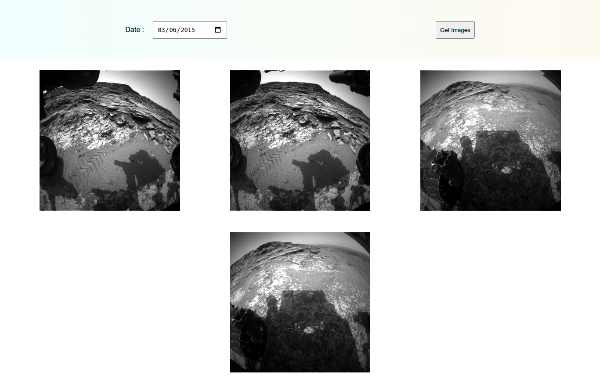

# mars-rover
A website in which we fetch mars rovers pics using NASA's API 
`(https://api.nasa.gov/mars-photos/api/v1/rovers/curiosity/photos?earth_date=2015-6-3&api_key=DEMO_KEY)`

- The web page looks like this 

- On entering the date, the web page would look like this 

